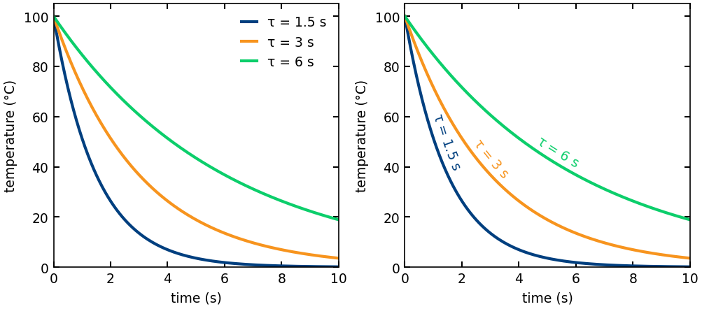
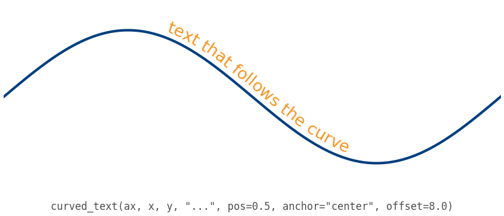
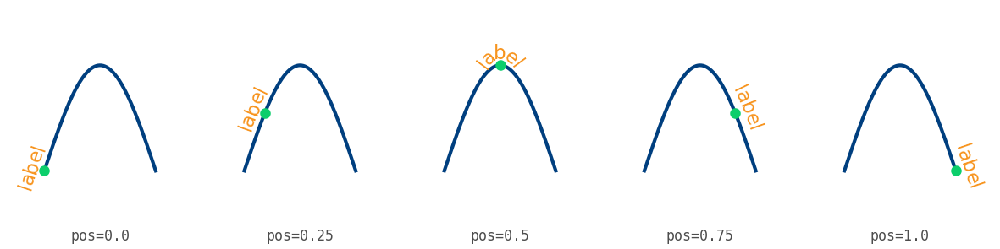
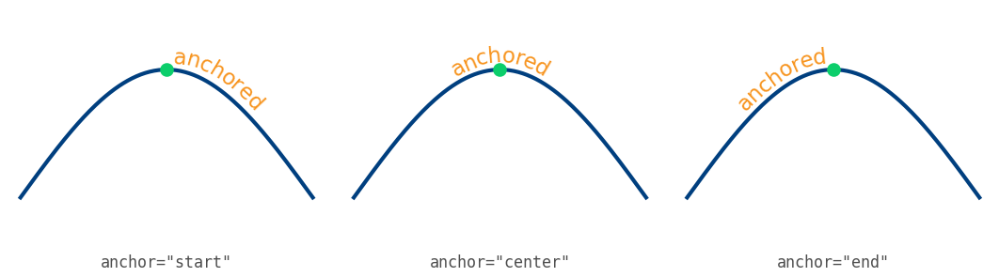
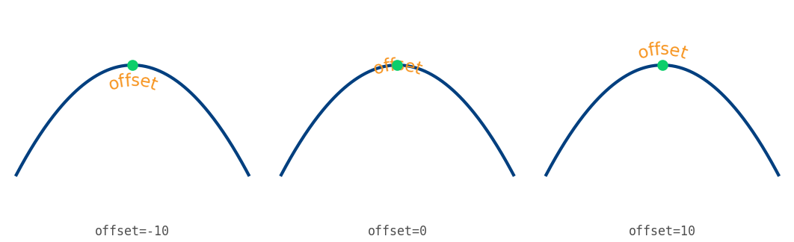
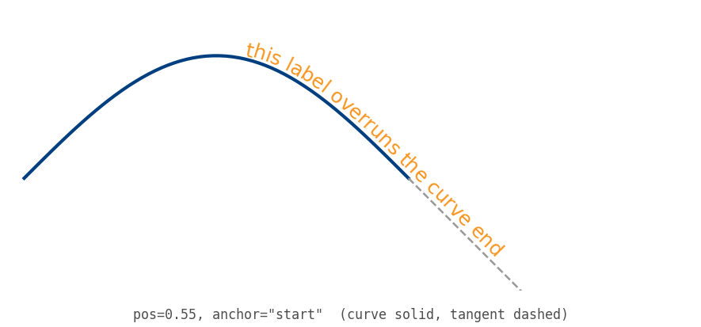
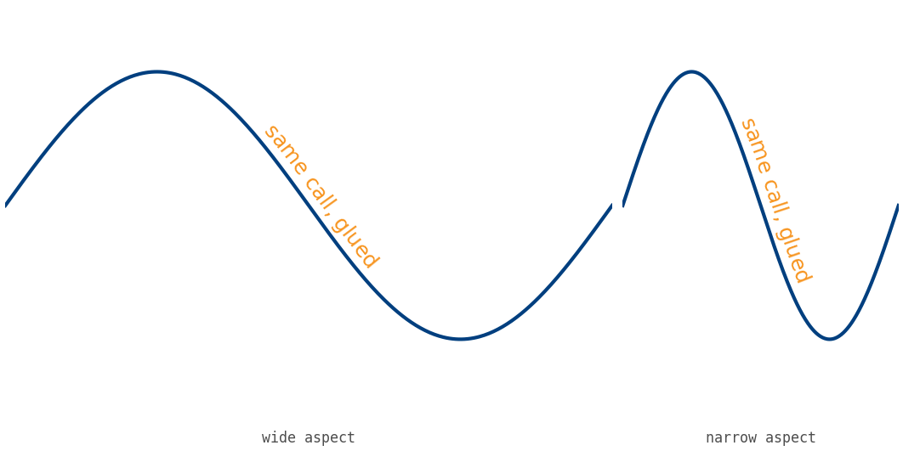
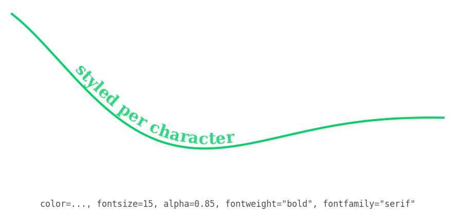

# Examples

A small gallery showing what [`curved-text`](../README.md) does and how to drive
it. Each figure is produced by a self-contained script in this directory; the
caption under each panel is the call that drew it.

Most scripts need only matplotlib and numpy (already installed with the
package). The one integration example also needs seaborn and pandas; install
those with the `examples` extra. Then regenerate everything into
[images/](images/):

```bash
pip install -e ".[examples]"
python examples/generate_all.py
```

Or run one script on its own:

```bash
python examples/example_02_sine_hello.py
```

The scripts follow the repository's plot conventions (colorblind-safe palette,
white background, sizes in centimetres, explicit dpi). Most panels hide their
axes on purpose: the subject is the text-on-curve geometry, so quantitative
ticks would only get in the way. The one true data figure -- direct labeling --
keeps its axes and units.

## The case for the tool

### Direct labeling replaces the legend

The reason the package exists. Left: a conventional legend forces the eye off
the data to decode a colour key. Right: each curve is labeled along its own
path -- no legend, no round trip.



[example_01_direct_labeling.py](example_01_direct_labeling.py)

### Hello, curve

One curve, one centred label riding it with a small perpendicular offset.



[example_02_sine_hello.py](example_02_sine_hello.py)

## The three placement controls

`pos`, `anchor`, and `offset` are independent. Each small-multiple below varies
one and holds the others fixed.

### `pos` -- where the label is anchored, as a fraction of arc length

The green dot marks the anchor point as `pos` runs from the first point (0.0) to
the last (1.0).



[example_03_pos_sweep.py](example_03_pos_sweep.py)

### `anchor` -- which part of the label lands at `pos`

The green dot is fixed at `pos=0.5` in every panel; the word's start, middle, or
end sits on it.



[example_04_anchor_triptych.py](example_04_anchor_triptych.py)

### `offset` -- a perpendicular shift off the curve

In points, along the chord normal. Positive is to the left of the direction of
travel -- above a left-to-right curve. The dot marks the on-curve anchor.



[example_05_offset_ladder.py](example_05_offset_ladder.py)

## Edge behaviors

### An overrun rides the end tangent

A long label on a short curve is not clipped: the curve is extended along its
end tangent (dashed) and the overrunning glyphs sit on that straight line.



[example_06_overrun_tangent.py](example_06_overrun_tangent.py)

### Glued through a change of aspect

The same curve and the same call, drawn at two aspect ratios. Layout is
recomputed per draw in display space, so spacing and offset stay correct -- the
label does not stretch or shear. This is the static stand-in for interactive
pan and zoom.



[example_07_glued_resize.py](example_07_glued_resize.py)

## Styling and integration

### Keyword arguments reach every character

Anything beyond the placement controls is forwarded verbatim to each
per-character `Text`.



[example_08_styling_passthrough.py](example_08_styling_passthrough.py)

### Any matplotlib-backed axes (seaborn, pandas)

`curved_text` only needs a `matplotlib.axes.Axes`, so it composes with seaborn,
`pandas.DataFrame.plot`, and anything else that draws on matplotlib. This script
renders only if seaborn and pandas are installed (they come with the `examples`
extra); they are not runtime dependencies of curved-text.

[example_09_seaborn_pandas.py](example_09_seaborn_pandas.py)
